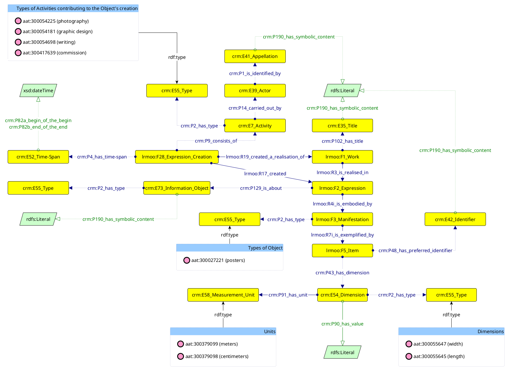
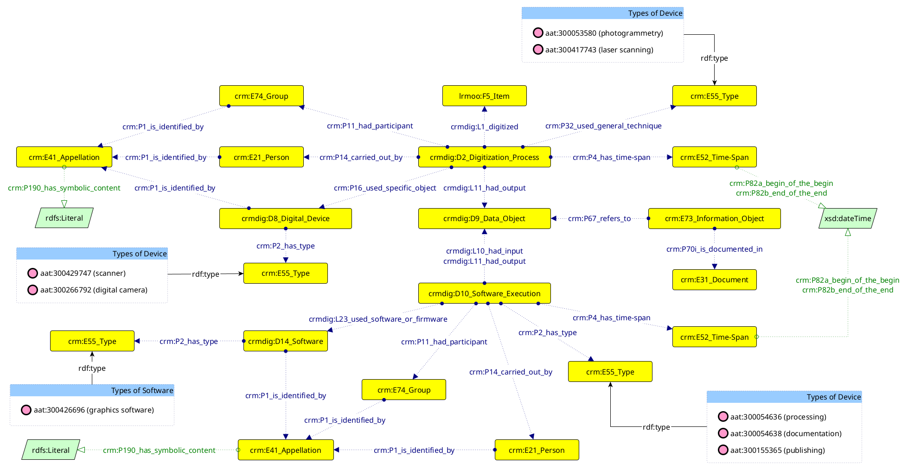

## Object (CHAD-AP)

A poster is described according to the Library Reference Model (LRM), which uses several descriptive layers for its representation. In particular:

* the _Work_ (`lrmoo:F1_Work`) represents the essence or conceptualisation of the poster. Each work is associated with a _title_ (`crm:E35_Title`).
* the _Expression_ (`lrmoo:F2_Expression`) is the realisation of a Work, and refers to the intellectual content of the object. Both the Expression and the Work are generated through a _creation event_ (`lrmoo:F28_Expression_Creation`) occurring within a specific _time span_ (`crm:E52_Time-Span`). A creation event consists of a series of smaller _activities_ (`crm:E7_Activity`), each conducted by one or more _agents_ (`crm:E39_Actor`) identified by their own _names_ (`crm:E41_Appellation`), and characterised by a specific _type_ (`crm:E55_Type`) that defines, implicitly, the role assumed by the agent for that activity. For example, if the agent is identified as the "photographer", the activity type is represented as _photography_ (`aat:300054225`). An Expression can also be associated with one or more _subjects_ defining its contents: a generic concept is represented with the class `crm:E73_Information_Object` with the type `aat:300404126` (i.e. _subject_) explicitly specified.
* the Manifestation (`lrmoo:F3_Manifestation`) represents the embodiment of the poster content in a physical format. It is characterised by having a _type_ (`crm:E55_Type`), which is `aat:300027221` (_posters_).
* the Item (`lrmoo:F5_Item`) represents the physical, localised exemplar of the poster. It is accompanied with an _identifier_ (`crm:E42_Identifier`). Also, the Item is characterised by having some _dimensions_ (`crm:E54_Dimension`), each with a _type_ (such as width or length), a _unit_ (`crm:E58_Measurement_Unit`), and a value.

---

## Process (CHAD-AP)

On the one hand, we have the _acquisition activity_ (`crmdig:D2_Digitization_Process`) involving the digitisation of a poster (`lrmoo:F5_Item`) to produce its digital equivalent (`crmdig:D9_Data_Object`). The digital poster can be associated with _copyright statements or licenses_ (`crm:E73_Information_Object` with `aat:300435434` as its type and documented by some authority resource online). The acquisition occurs within a _time span_ (`crm:E52_Time-Span`) with defined starting and ending date times, and engages various agents, including _individuals_ (`crm:E21_Person`) and _institutions_ (`crm:E74_Group`) responsible for the activity. During the acquisition, a series of _techniques_ (`crm:E55_Type`) can be used, such as _photogrammetry_ (`aat:300053580`) or _laser scanning_ (`aat:300417743`), along with _tools_ (`crmdig:D8_Digital_Device`) like _digital cameras_ (`aat:300266792`) and _scanners_ (`aat:300429747`).

On the other hand, we have _software activities_, each representing a specific stage of the digitisation workflow (`crmdig:D10_Software_Execution`). Such stage is denoted by its _type_ (`crm:E55_Type`), such as _processing_ (`aat:300054636`). It also involves some form of manipulation of the _digital poster_ (`crmdig:D9_Data_Object`) produced previously as input and the production of a new version of that digital poster (`crmdig:D9_Data_Object`) as output. The activity also occurs within a defined _time span_ (`crm:E52_Time-Span`) with precise start and end date times, engages various agents (`crm:E21_Person` for _people_ and `crm:E74_Group` for _institutions_), and uses _software_ (`crmdig:D14_Software`) to produce an output.

People, institutions, devices and software can be identified by _names_ (`crm:E41_Appellation`).
