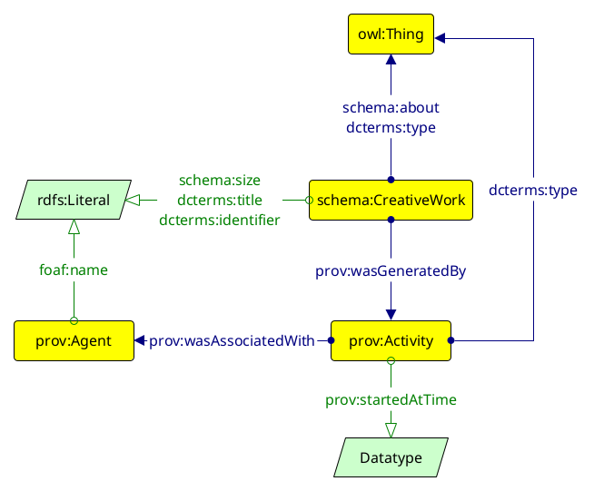
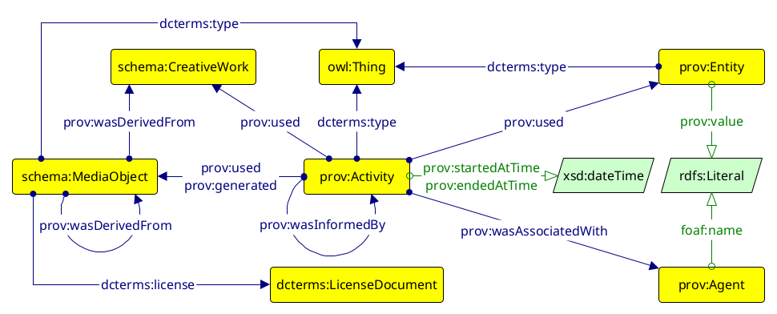

## Object (PROV)

A poster (`schema:CreativeWork`) is characterised by:

- a _identifier (`dcterms:identifier`)
- a _title_ (`dcterms:title`)
- a _size_ (`dcterms:size`)
- a type (`dcterms:type`, in this case it's always `wd:Q429785 (poster)`)
- one or more subjects (`schema:about`), possibly rendered as instances on Wikidata

A poster is generated by one or more instances of `prov:Activity`, each with:

- a `prov:Agent` carrying it out, named through `foaf:name`
- a timestamp (`prov:startedAtTime`)
- a type (`dcterms:type`) with a set of possible values, including:
    - `wd:Q11633 (photography)`
    - `wd:Q185925 (graphic design)`
    - `wd:Q624896 (copywriting)`
    - `wd:Q760089 (commission)`

---

## Process (PROV)

A digitisation activity (`prov:Activity`) is characterised by:

- a type (`dcterms:type`) with a set of possible values, including:
    - `wd:Q1172399 (acquisition)` 
    - `wd:Q6661985 (processing)`
    - `wd:Q99194075 (documenting)`
    - `wd:Q3972943 (publishing)`
- an input (`prov:used`) which could be either the physical poster (`schema:CreativeWork`) or its digitised replica (`schema:MediaObject`) at a certain stage of the digitisation process
- an output (`prov:generated`) which is a digitised replica of the physical object (`schema:MediaObject`)
- a previous activity (`prov:wasInformedBy`)
- a person or organisation carrying out tthe digitisation activity (`prov:wasAssociatedWith`), named via `foaf:name`
- a beginning (`prov:startedAtTime`) and an end (`prov:endedAtTime`)
- one or more tools (`prov:used`) to carry it out (`prov:Entity` with `dcterms:type` pointing at something like `wd:Q82744 (image scanner)`)
- one or more techniques (`prov:used`) to carry it out (`prov:Entity` with `dcterms:type` pointing at something like `wd:Q1435078 (focus stacking)`)

Each digital object produced during the digitisation process (`schema:MediaObject`) has its own license (`dcterms:license` pointing at a `dcterms:LicenseDocument`, which is a web page like http://creativecommons.org/licenses/by-sa/4.0/), and points to the previous object it was derived from (either the physical object or another digital object).
